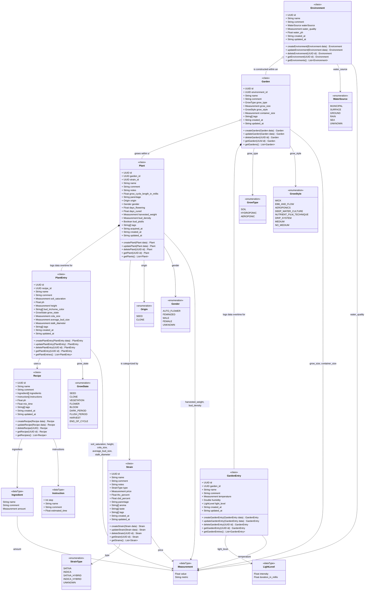

## Garden Data Class Diagram

```mermaid
 classDiagram
    direction TB

    Environment o-- Garden : is constructed within an
    Environment --> WaterSource : water_source
    Environment --> Measurement : water_quality

    Garden o-- Plant : grows within a
    Garden *-- GardenEntry : logs data overtime for
    Garden --> GrowType : grow_type
    Garden --> GrowStyle : grow_style
    Garden --> Measurement : grow_size, container_size

    GardenEntry --> LightLevel : light_level
    GardenEntry --> Measurement : temperature

    Plant *-- PlantEntry : logs data overtime for
    Plant --> Strain : is categorized by
    Plant --> Origin : origin
    Plant --> Gender : gender
    Plant --> Measurement : harvested_weight, bud_density

    PlantEntry --> Recipe : uses a
    PlantEntry --> GrowState : grow_state
    PlantEntry --> Measurement : soil_saturation, height, cola_size, average_bud_size, stalk_diameter

    Strain --> StrainType : type
    Strain --> Measurement : price

    Recipe --> Ingredient : ingredient
    Recipe --> Instruction : instructions
    Ingredient --> Measurement : amount

    class Measurement {
      <<dataType>>
      Float value
      String metric
    }

    class WaterSource {
      <<enumeration>>
      MUNICIPAL
      SURFACE
      GROUND
      RAIN
      SEA
      UNKNOWN
    }

    class Environment {
        <<class>>
        + UUID id
        + String name
        + String comment
        + WaterSource waterSource
        + Measurement water_quality
        + Float water_ph
        + String created_at
        + String updated_at

        + createEnvironment(Environment data) Environment
        + updateEnvironment(Environment data) Environment
        + deleteEnvironment(UUID id) Environment
        + getEnvironment(UUID id) Environment
        + getEnvironments() List~Environment~
    }

    class GrowType {
      <<enumeration>>
      SOIL
      HYDROPONIC
      AEROPONIC
    }

    class GrowStyle {
      <<enumeration>>
      WICK
      EBB_AND_FLOW
      AEROPONICS
      DEEP_WATER_CULTURE
      NUTRIENT_FILM_TECHNIQUE
      DRIP_SYSTEM
      MEDIUM
      NO_MEDIUM
    }

    class Garden {
        <<class>>
        + UUID id
        + UUID environment_id
        + String name
        + String comment
        + GrowType grow_type
        + Measurement grow_size
        + GrowStyle grow_style
        + Measurement container_size
        + String[] tags
        + String created_at
        + String updated_at

        + createGarden(Garden data) Garden
        + updateGarden(Garden data) Garden
        + deleteGarden(UUID id) Garden
        + getGarden(UUId id) Garden
        + getGardens() List~Garden~
    }


    class LightLevel {
      <<dataType>>
      Float intensity
      Float duration_in_millis
    }

    class GardenEntry {
        <<class>>
        + UUID id
        + UUID garden_id
        + String name
        + String comment
        + Measurement temperature
        + Double humidity
        + LightLevel light_level
        + String created_at
        + String updated_at

        + createGardenEntry(GardenEntry data) GardenEntry
        + updateGardenEntry(GardenEntry data) GardenEntry
        + deleteGardenEntry(UUID id) GardenEntry
        + getGardenEntry(UUID id) GardenEntry
        + getGardenEntries() List~GardenEntry~
    }

    class Origin {
      <<enumeration>>
      SEED
      CLONE
    }

    class Gender {
      <<enumeration>>
      AUTO_FLOWER
      FEMINIZED
      MALE
      FEMALE
      UNKNOWN
    }

    class Plant {
        <<class>>
        + UUID id
        + UUID garden_id
        + UUID strain_id
        + String name
        + String comment
        + String notes
        + Float grow_cycle_length_in_millis
        + String parentage
        + Origin origin
        + Gender gender
        + Float days_flowering
        + Float days_cured
        + Measurement harvested_weight
        + Measurement bud_density
        + Boolean bud_pistils
        + String[] tags
        + String acquired_at
        + String created_at
        + String updated_at

        + createPlant(Plant data) Plant
        + updatePlant(Plant data) Plant
        + deletePlant(UUID id) Plant
        + getPlant(UUID id) Plant
        + getPlants() List~Plant~
    }

    class GrowState {
      <<enumeration>>
      SEED
      CLONE
      VEGETATION
      FLOWER
      BLOOM
      DARK_PERIOD
      FLUSH_PERIOD
      HARVEST
      END_OF_CYCLE
    }

    class PlantEntry {
        <<class>>
        + UUID id
        + UUID recipe_id
        + String name
        + String comment
        + Measurement soil_saturation
        + Float ph
        + Measurement height
        + String[] bud_trichome_color
        + GrowState grow_state
        + Measurement cola_size
        + Measurement average_bud_size
        + Measurement stalk_diameter
        + String[] tags
        + String created_at
        + String updated_at

        + createPlantEntry(PlantEntry data) PlantEntry
        + updatePlantEntry(PlantEntry) PlantEntry
        + deletePlantEntry(UUID id) PlantEntry
        + getPlantEntry(UUID id) PlantEntry
        + getPlantEntries() List~PlantEntry~
    }

    class StrainType {
      <<enumeration>>
      SATIVA
      INDICA
      SATIVA_HYBRID
      INDICA_HYBRID
      UNKNOWN
    }

    class Strain {
      <<class>>
      + UUID id
      + String name
      + String comment
      + String notes
      + StrainType type
      + Measurement price
      + Float thc_percent
      + Float cbd_percent
      + String parentage
      + String[] aroma
      + String[] taste
      + String[] tags
      + String created_at
      + String updated_at

      + createStrain(Strain data) Strain
      + updateStrain(Strain data) Strain
      + deleteStrain(UUID id) Strain
      + getStrain(UUID id) Strain
      + getStrains() List~Strain~
    }

    class Ingredient {
      <<dataType>>
      String name
      String comment
      Measurement amount
    }

    class Instruction {
      <<dataType>>
      + Int step
      + String name
      + String comment
      + Float estimated_time
    }

    class Recipe {
        <<class>>
        + UUID id
        + String name
        + String comment
        + Ingredient[] ingredients
        + Instruction[] instructions
        + Float ph
        + Float mix_time
        + String[] tags
        + String created_at
        + String updated_at

        + createRecipe(Recipe data) Recipe
        + updateRecipe(Recipe data) Recipe
        + deleteRecipe(UUID ) Recipe
        + getRecipe(UUID id) Recipe
        + getRecipies() List~Recipe~
    }
```
